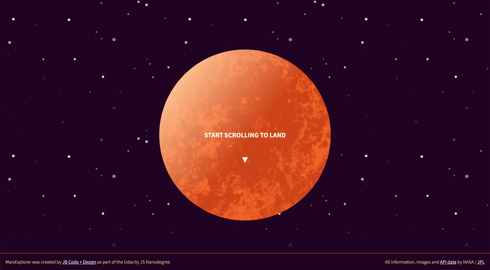
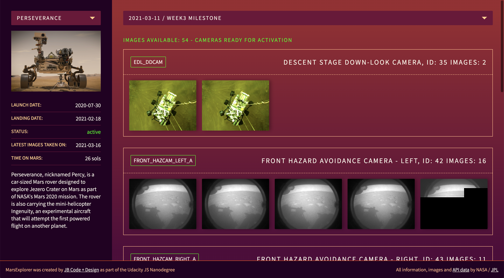

# Mars Explorer
## Get to know Mars and the NASA Mars rovers in this an interactive NASA API viewer

### Part of the Intermediate Javascript Nanodegree from Udacity




See it work here: https://nasa-mars-dashboard.herokuapp.com/

## Big Picture

A Mars rover dashboard that consumes the NASA API.

### Getting Started

1. You may clone this repo and will need to install the dependencies

 * For this project we are using yarn as our package manager, so to install your depencies run:

```yarn install```

**If you don’t have yarn installed globally, follow their installation documentation here according to your operating system: https://yarnpkg.com/lang/en/docs/install
2. Next you'll need a NASA developer API key in order to access the API endpoints. To do that, go here: https://api.nasa.gov/. If you want to simply look around at what api endpoints NASA offers, you can use their provided DEMO_KEY to do this.

3. In your repo, you will see a .env - example file with a place for your API key. Rename or copy the file to one called `.env` and enter in your key. Now that you have your key, just remember to add it as a parameter to every request you make to NASA.

4. Run `yarn start` in your terminal and go to `http:localhost:3000` to check that your app is working. If you don't see a date drop down and cameras after picking a rover, check that your api key is set up correctly.


### Project Details

UI features:

* A gallery of the most recent images sent from each mars rover
* The launch date, landing date, name and status along with any other information about the rover
* A selection bar for the user to choose which rover's information they want to see
* Responsive layout, optimized for phones(max width 768px) and desktop(min-width 991px, max-width 1824px) and Tablet view.
* Dynamically switch the UI to view one of the three rovers via dropdown select

The frontend code:

* Uses only pure functions
* Uses at least one Higher Order Function
* Uses the array method `map`
* Uses the ImmutableJS library

The project is:

* Built with Node/Express
* Makes calls to the NASA API
* Uses pure functions to do any logic necessary
* Hides any sensetive information from public view (using a dotenv file)

### Further functionality

* Dynamic list of milestone dates for each rover – these are based on landing dates and will display weekly, monthly or annual milestones depending on how long the rover has been active on Mars
* Image galleries are sorted by cameras. To add a little interactivity these need to be activated to view the images
* Image galleries are build up as clickable sliding thumbnails – this is mostly to save space for rovers/dates with a very high number of images


### Design

* The design is based on my own graphics, you may not use these without credit to JB Code + Design – jbeadle.de
* The layout is responsive
* Some additional animation has been added with CSS and JS – JS that serves purely stylistic purposes (i.e. adding classes or calculating scrolling height) has been moved to its own file styling.js for better separation of concerns


